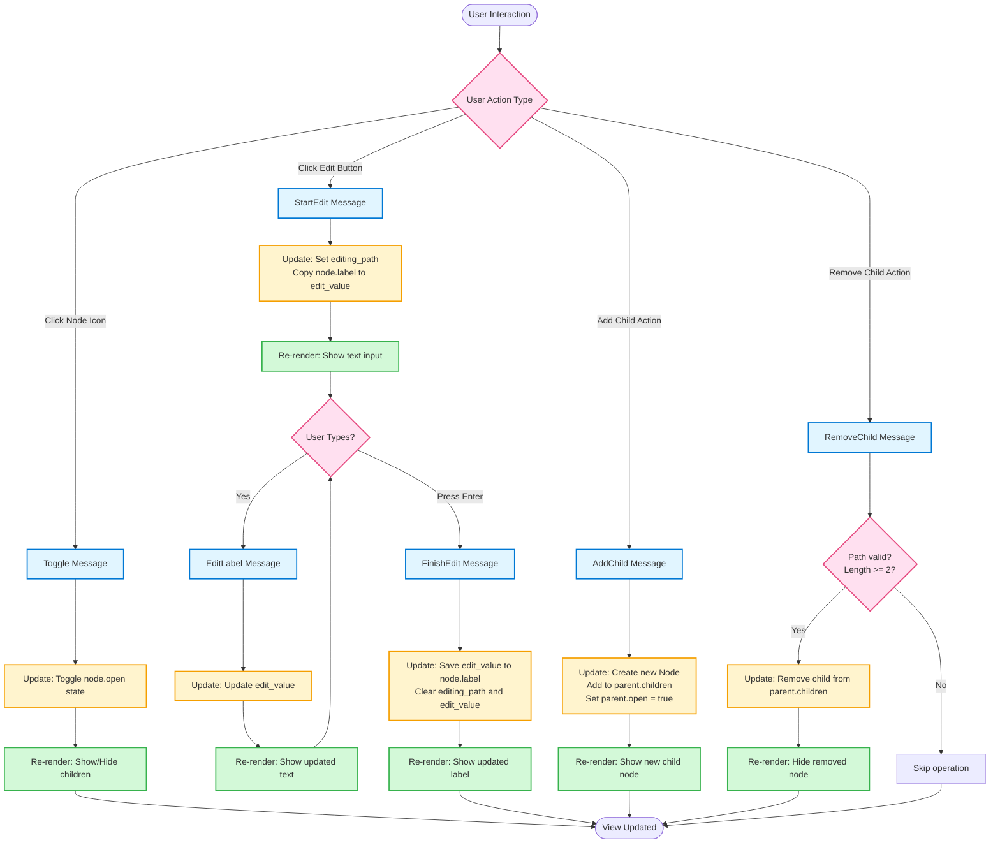

# Event Flow Diagram

This document describes the event flow in the iced-demo tree view application.

## Overview

The application uses a message-passing architecture where user interactions generate messages that are processed by the `update` method to modify the application state.

## Event Flow Diagram

## Message Types

### Toggle
**Purpose**: Open or close a tree node to show/hide its children

**Flow**:
1. User clicks on a node's expand/collapse icon
2. `Message::Toggle(path)` is sent to update
3. The node's `open` state is inverted
4. View is re-rendered, showing or hiding child nodes

### StartEdit
**Purpose**: Begin editing a node's label

**Flow**:
1. User clicks the edit button (✏) on a node
2. `Message::StartEdit(path)` is sent to update
3. The current node's label is copied to `edit_value`
4. The node's path is stored in `editing_path`
5. View is re-rendered, replacing the label with a text input field

### EditLabel
**Purpose**: Update the edit buffer as the user types

**Flow**:
1. User types in the text input field
2. `Message::EditLabel(value)` is sent for each keystroke
3. The `edit_value` is updated with the new text
4. View is re-rendered, showing the updated text in the input field

### FinishEdit
**Purpose**: Complete editing and save the new label

**Flow**:
1. User presses Enter in the text input field
2. `Message::FinishEdit` is sent to update
3. The `edit_value` is copied to the node's `label`
4. `editing_path` is cleared (set to None)
5. `edit_value` is cleared
6. View is re-rendered, showing the updated label in normal view

### AddChild
**Purpose**: Add a new child node to a parent node

**Flow**:
1. User triggers add child action
2. `Message::AddChild(path)` is sent to update
3. A new `Node` with label "New Node" is created
4. The new node is added to the parent's `children` vector
5. The parent's `open` state is set to true
6. View is re-rendered, showing the new child node

### RemoveChild
**Purpose**: Remove a child node from its parent

**Flow**:
1. User triggers remove child action
2. `Message::RemoveChild(path)` is sent to update
3. The path is validated (must have at least 2 elements)
4. If valid, the child is removed from the parent's `children` vector
5. View is re-rendered, hiding the removed node

## State Management

The application maintains three key pieces of state:

- **roots**: `Vec<Node>` - The root nodes of the tree
- **editing_path**: `Option<Vec<usize>>` - The path to the node currently being edited (None if not editing)
- **edit_value**: `String` - The current text in the edit input field

## Path System

Nodes are identified by their path, which is a `Vec<usize>`:
- `[0]` - First root node
- `[0, 1]` - Second child of the first root
- `[0, 1, 2]` - Third child of the second child of the first root

This path system allows efficient navigation through the tree structure.
